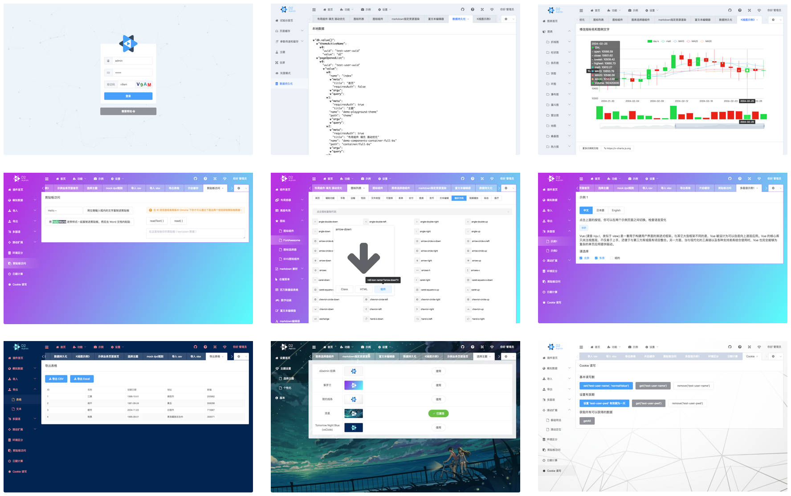

# 介绍

D2Admin 是一个开源的管理系统前端集成方案

<div>
  <iframe src="//ghbtns.com/github-btn.html?user=d2-projects&repo=d2-admin&type=star&count=true" allowtransparency="true" frameborder="0" scrolling="0" width="100" height="20"></iframe>
  <iframe src="//ghbtns.com/github-btn.html?user=d2-projects&repo=d2-admin&type=fork&count=true" allowtransparency="true" frameborder="0" scrolling="0" width="100" height="20"></iframe>
</div>

本项目仓库在 Github 和 Gitee 同步发布

[中文文档](http://d2admin.fairyever.com/zh/)

**完整版**

[Github 仓库](https://github.com/d2-projects/d2-admin) | 
[码云仓库](https://gitee.com/fairyever/d2-admin) | 
[预览地址](https://fairyever.gitee.io/d2-admin-preview)

**简化版模板**

[Github 仓库](https://github.com/d2-projects/d2-admin-start-kit) | 
[码云仓库](https://gitee.com/fairyever/d2-admin-start-kit) | 
[预览地址](https://fairyever.gitee.io/d2-admin-start-kit-preview/#/index)



D2Admin 完整版集成了很多的插件和组件，首次加载会占用很多的时间，所以加入了首屏加载动画。

如果您欣赏 D2Admin 的设计风格，希望基于它开发您的管理系统，**建议使用 [d2-admin-start-kit 简化模板](https://github.com/d2-projects/d2-admin-start-kit)**，简化版模板保留了所有的系统功能，包括登陆注销，主题切换，图标，数据持久化等。其它不必要的组件和插件您可以参照 D2Admin 完整版自行加入。

如果您执意在完整版基础上开发，请您在发布之前一定要删除没有用到的代码，比如项目没有用到图表、示例、插件组件。

D2Admin 是完全开源免费的管理系统集成方案，由 [FairyEver](https://github.com/FairyEver) 工作之余完完成（希望您看到这里，可以移步 [Github](https://github.com/d2-projects/d2-admin) 点个 star 支持我），如果你也一样喜欢前端开发，欢迎加入我们的讨论/学习群，群内可以`提问答疑`，`分享学习资料`。


::: tip Thanks
D2Admin 创建于2018年1月14日零点51分，四个月后在2018年5月26日正式发布，39天时间 star 突破 1k ，在此对所有的 D2Admin 支持者表示感谢，项目将会保持更新，如果你有想法、建议、或者问题欢迎加群讨论

—— 2018年7月5日
:::

> 1000 star 后 D2Admin 现已由一人维护改为归属于 [D2 Projects Organizations](https://github.com/d2-projects) 由多人维护

## 功能

* 首屏加载等待动画 避免首次加载白屏尴尬
* 简约主题
* 每个插件和组件都配有介绍文档
* 图片资源 sketch 源文件（ 可以在这个文件内重新生成所有图片资源 ）
* 登陆和注销
* 根据路由自动生成菜单
* 可折叠侧边栏
* 方便的菜单设置
* 多国语言支持
* 富文本编辑器
* Markdown 编辑器
* 全屏功能
* Fontawesome 图标库
* 图标选择器（组件）
* 自动引入下载的 SVG 图标
* 前端假数据支持（ mock ）
* 集成蚂蚁金服出品的 G2 图表
* 图表自适应可拖拽大小的卡片容器（示例）
* 简化剪贴板操作
* 简化Cookie操作
* 时间日期计算工具
* 导入 Excel （ xlsx 格式 + csv 格式 ）
* 数据导出 Excel （ xlsx 格式 + csv 格式 ）
* 数据导出文本
* 数字动画
* 可拖拽调整大小的切分布局
* 可拖拽调整大小和位置的网格布局
* 提供三种方便的页面容器组件（正常卡片，隐形容器，填满页面）
* 代码高亮显示
* 加载并解析（或者直接指定资源） markdown 文件
* GitHub 样式的 markdown 显示组件
* markdown 内代码高亮
* 为 markdown 扩展了百度云链接解析和优化显示
* 右键菜单组件
* 自定义滚动条和滚动控制
* 内置5种主题
* 公用样式抽离，方便的主题定制
* 支持百万级数据量的表格组件
* 打包后随意目录部署（已经做好兼容设置）
* 支持临时菜单配置
* 提供“试验台”功能 方便展示系统功能调用方法 `1.1.4 +`
* 多标签页模式 `1.1.4 +`
* 美化滚动条 `1.1.4 +`
* json view `1.1.4 +`

## TODO

D2Admin 仍然处于开发中，这里有一些暂时的计划：

* 分离出简化版本
* 推出基于 [ice](https://alibaba.github.io/ice) 平台的版本
* 增加右上角通知中心
* 增加一些实例页面以提供业务页面布局建议
* 面包屑导航
* 树型表格组件
* 更多类型的编辑器
* socket 连接
* 浏览器版本提示
* 日志控制台
* d2-container 组件 ghost 模式和 full 模式合并
* `1.1.4 已完成` 自定义滚动条
* `1.1.4 已完成` 多 tab 页结构
* `1.1.3 已完成` 更换图表库
* `1.1.0 已完成` 抽离项目里的文档，集中存放在文档站点
* `1.1.0 已完成` 对主界面进行一次完善，调整整体布局和颜色
* `1.1.0 已完成` 切换主题功能

欢迎你为 D2Admin 的开发作出贡献（代码编写/文档翻译）。

## 目录结构

```
├─ build
├─ config
├─ deploy
├─ dist
├─ docs // 文档
├─ src
│  ├─ assets // 资源
│  │  ├─ icons
│  │  ├─ image
│  │  ├─ library
│  │  └─ style
│  ├─ components // 组件
│  │  ├─ charts // 图表组件
│  │  ├─ core // 核心组件
│  │  └─ demo // 示例组件
│  ├─ i18n // 多国语
│  ├─ libs // 通用库
│  ├─ menu // 菜单
│  ├─ mock // 模拟数据
│  ├─ pages // 页面
│  ├─ plugin // 插件
│  ├─ router // 路由
│  ├─ store // vuex
│  ├─ App.vue
│  └─ main.js
├─ static // 静态资源
├─ .babelrc
├─ .editorconfig
├─ .eslintignore
├─ .eslintrc.js
├─ .gitattributes
├─ .gitignore
├─ .postcssrc.js
├─ LICENSE
├─ README.md
├─ index.html
└─ package.json
```

## 获取代码

有两种方式可以获得 D2Admin 的代码

* 在 [releases](https://github.com/d2-projects/d2-admin/releases) 页面下载最新的发行版。发行版一般是完成了某个大升级或者修复重要 bug 后发布的压缩包，你可以下载下来直接使用

* Fork 仓库到你的 github 然后克隆到本地，然后使用 master 分支继续你的开发。这种方式得到的是最新的代码，但是会有未完成的新功能。**不建议使用这种方式**

* 由于 github 访问较慢，推荐前往码云仓库下载 [gitee.com/fairyever/d2-admin](https://gitee.com/fairyever/d2-admin)，码云上的仓库**在每次发布版本或者修复 bug 才会更新**，所以如果你选择此方法，请直接 fork 仓库并克隆到本地

> 码云的仓库由 github 同步，但是发行版和标签同步有一些问题，所以推荐直接 fork 仓库

## 使用

```
// 安装依赖
npm i

// 运行
npm run dev

// 打包
npm run build
```

> 如果上述步骤出现错误，建议您升级 node 版本 > 8，如果有其它疑问请参考[常见问题](/zh/guide/question.html)